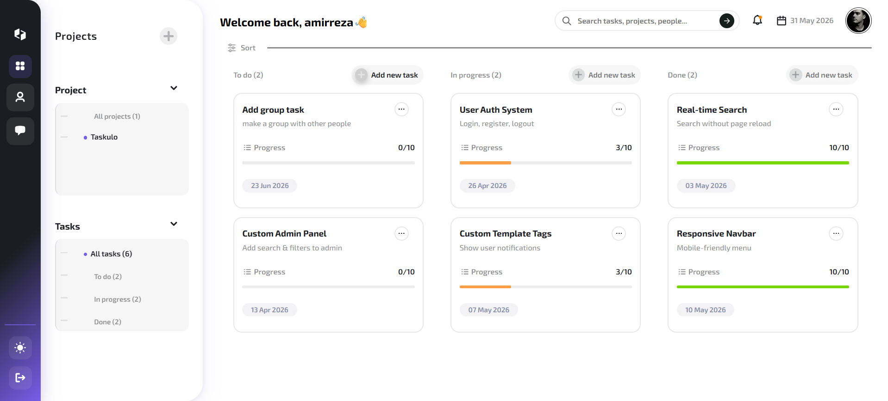

# Taskulo

Taskulo is a modern task and project management platform designed to help individuals and teams organize their work efficiently. It provides a clean and responsive interface for managing projects, tracking tasks, and staying updated with real-time notifications.


## Badges


## Screenshots

### 📊 Dashboard


## Tech Stack

**Backend:**
- Python
- Django

**Database:**
- SQLite / PostgreSQL

**Frontend:**
- HTML
- CSS
- JavaScript
## Features

- 🔐 User registration and authentication system  
- 📧 Email verification for secure account activation  
- 👤 User account management and profile handling  

- 🏠 Landing page for product introduction  

- 📊 Personalized dashboard for projects & tasks  
- 📁 Project organization and management system  

- 📝 Create, edit, and delete tasks  
- 📈 Track task progress and status updates  

- 🔔 Notifications for task status changes  

- 🎨 Modern and responsive user interface

## Planned Features

- 🔌 Dedicated REST API for external integrations  
- 🤖 Telegram Bot integration via API  
- 📝 Create and manage tasks directly from Telegram  
- 🔔 Telegram notifications for project and task updates  
- 🧠 AI-powered task management assistant  
- 💬 Create tasks using natural language conversations  
- 📊 Intelligent task analysis and categorization
## Installation

Follow these steps to run the project locally:

### 1. Clone the repository
```bash
git clone https://github.com/alicombot/taskulo.git
cd taskulo
```
### 2. Create virtual environment
```bash 
python -m venv venv
```
### 3. Activate virtual environment

Windows:
```bash
venv\Scripts\activate
```
Linux / Mac:
```bash
source venv/bin/activate
```
### 4. Install dependencies
```bash
pip install -r requirements.txt
```
### 5. Run migrations
```bash
python manage.py migrate
```
### 6. Create superuser (optional)
```bash
python manage.py createsuperuser
```
### 7. Run the server
```bash
python manage.py runserver
```
Then open in your browser:
```bash
http://127.0.0.1:8000/
```

## Usage/Examples

- Create a new account and verify email  
- Log in to access dashboard  
- Create a project  
- Add tasks inside a project  
- Track task progress and status updates


## Environment Variables

This project uses environment variables to manage sensitive settings.

Create a `.env` file and configure your Django settings accordingly (SECRET_KEY, DEBUG, database credentials).
## Roadmap

- 🔌 API development for external integrations  
- 🤖 Telegram bot integration  
- 🧠 AI assistant integration for smart task management  
- 👥 Team collaboration features  
- 📊 Advanced analytics and reporting system
## Authors

- [@amirreza4602](https://www.github.com/amirreza4602)

- [@alicombot](https://www.github.com/alicombot)


## License

[MIT](https://choosealicense.com/licenses/mit/)

